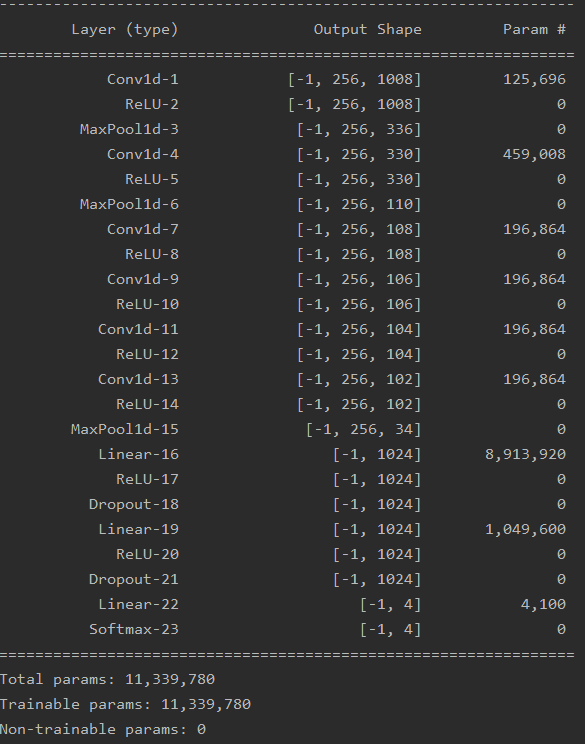
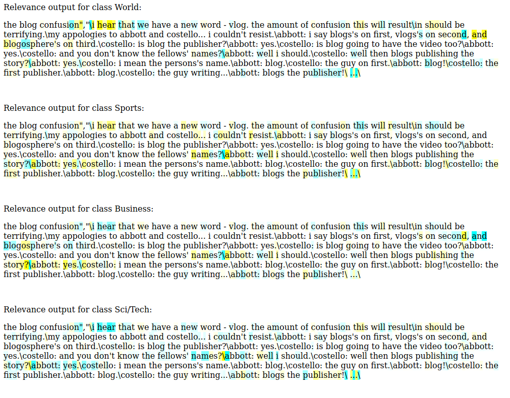

# Explaining Deep Convolutional Text Classification on a Character-Level

Using a deep neural network to classify news-text articles and then explain the classification process using LRP and integrated gradients.

As datasets I either used the AGNews corpus (containing news articles of 4 classes) and the 20Newsgroup dataset (containing news articles of 20 classes). Each input is capped at 1024 characters and is padded with space if needed. The characters are one-hot encoded.

Using the LRP algorithm I can backpropagate relevance from the classification layer to the input and assign a relevance score to each character of the input. Relevance can be either positive indicating a positive for the classification as a specific class or a negative relevance with indicates that this character seperated would classify as a different class. Since LRP produces relevances with respect to a certain class the results differ for different classification.

Diffent relevances for the 4 different classes of the AGNews dataset:

(blue is a positive score, yellow is negative relevance)

